# GDD — Highway to Heaven  
**Hecho por “Rocky Games”: Zhuokai Zhu, Chenlinjia Yi, Javier Cáceres Polo y Antonio Bucero Coronel**

  -----------------------------------------------------------------------
  Nombre del juego                    Highway to Heaven
  ----------------------------------- -----------------------------------
  Género                              Plataforma/Acción

  Números de jugadores                1 jugador

  Plataform                           PC - Window 10 o mayor
  -----------------------------------------------------------------------

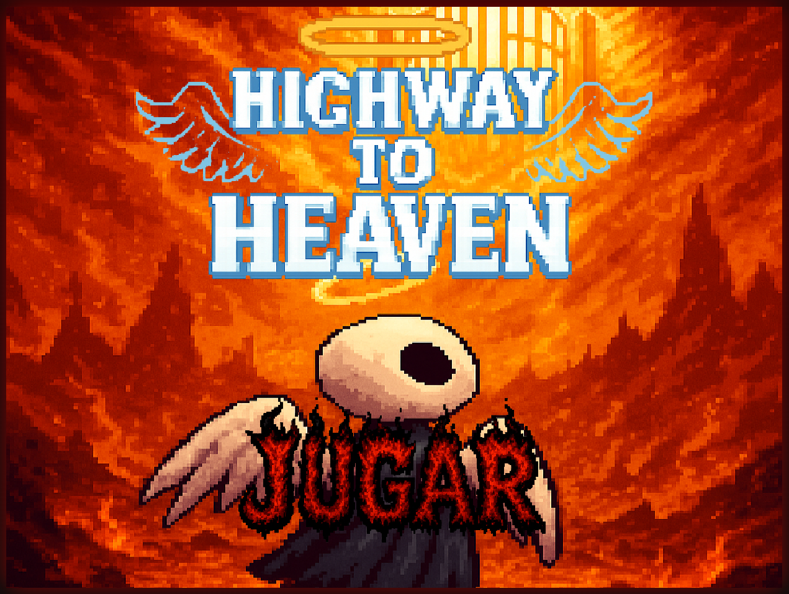

# **Índice**

[**Descripción básica del juego**](#descripción-básica-del-juego)

[**Cartas y Requisitos PVLI**](#cartas-y-requisitos-pvli)

[**Visión del juego**](#visión-del-juego)

> [Historia](#historia)
>
> [Mundo](#mundo)
>
> [Estilo Artístico](#estilo-artístico)

[**Mecánicas del juego**](#mecánicas-del-juego)

> [Ciclo del juego](#ciclo-del-juego)
>
> [Controles](#controles)
>
> [Objetivos del jugador](#Objetivos-del-jugador)
>
> [Sistemas](#sistemas)
>
> [Sistema movimiento ](#Sistema-movimiento)
>
> [Sistema de combate ](#sistema-de-combate)
>
> [Sistema de armas ](#sistema-de-habilidades)
>
> [Sistema de interactuar ](#sistema-de-interactuar)
>
> [Sistema enemigos ](#Enemigos-principales)
>
> [Sistema de vida ](#sistema-de-vida)
>
> [Reglas/Normas ](#Sistema-movimiento)

[**Contenido**](#contenido)

> [Niveles ](#niveles)
>
> [Enemigos básicos ](#enemigos-principales)
>
> [Bosses ](#Bosses)
>
> [Música y sonido ](#música-y-sonido)

[**UI**](#UI)

> [Menús principales ](#menús-principales)
>
> [HUD ](#HUD)
>
> [Cámara ](#cámara)

[**Referencias**](#referencias)

# **Descripción básica del juego**

Highway to Heaven es un juego de plataforma, acción con estilo
pixel-art, en el cual el jugador controla a un ángel que por desgracia
cayó del cielo al infierno. Es un juego parecido al Hollow Knight, es
decir una especie de metroidvania 2d, con una perspectiva lateral o
perfil.

Al inicio de la partida, saldrá un texto o dibujo explicando lo
sucedido.

Y...comienza la aventura.

# **Cartas y Requisitos PVLI**

Cartas actuales:

-   Personajes/Objetos: tristeza e ira (1+1 de alcance).

-   Mecánicas: plataforma, discovery y bullet hell (1+2+3 de alcance).

-   Ambiente: infierno (1 de alcance).

Requisitos o bono extra que se realizará: meter "floor is lava" (1 de alcance),
combinar la carta de emoción tristeza e ira

Requisitos o bono extra que NO se realizará: no tener el teclado como
control del juego.

Efecto de carta recibido desde el grupo 10: somos obligamos a incluir personaje Miedo en nuestro juego (1 de alcance)

Efecto de carta que aplicamos al grupo 10: son obligados a meter personaje Tristeza en el juego  (1 de alcance)

Alcance total: 12

# **Visión del juego**

## **Historia**

El ángel, el personaje principal, por un accidente cayó al infierno, y
sufrió graves lesiones. Su poder, se dividió en cuatro, formándose en
cuatro seres poderosos de emociones distintas, eso implica a que el
pobre angelito, ha perdido los respectivos sentimientos.

Para poder volver al cielo, el ángel debe de recuperar su poder, es
decir debe derrotar a los cuatro bosses.

## **Estilo Artístico**

El juego tiene un estilo pixel-art y se usa la mayoría de las veces la
paleta de color oscuro, para tener una ambientación del inframundo.

Dependiendo de la zona del boss, se usará un color específico, por
ejemplo la ira, color rojo, la tristeza, color azul. Pero, siempre
combinando con el negro.

Ejemplo de arte de la zona boss ira:

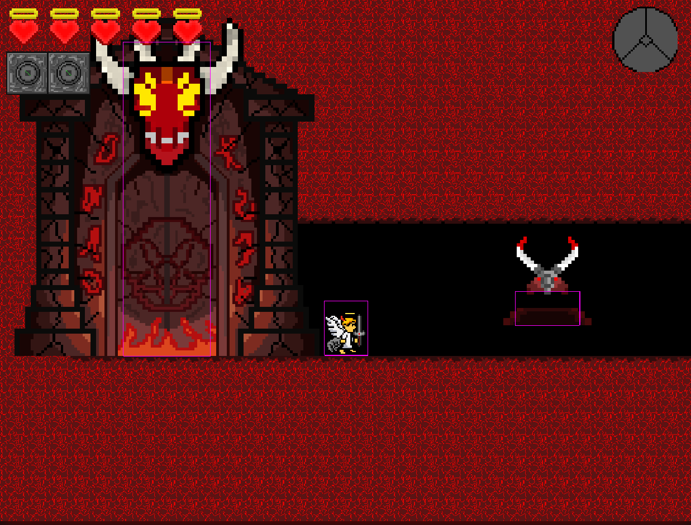

## **Mundo**
El juego se desarolla en el inframundo, que esta dividido en 4 zonas, zona inicial (izquierda arriba), zona ira(roja), zona tristeza(azul), zona boss final(amarilla), en el que hay una sala boss por zona y una sala boss extra (boss miedo) que esta en zona tristeza.

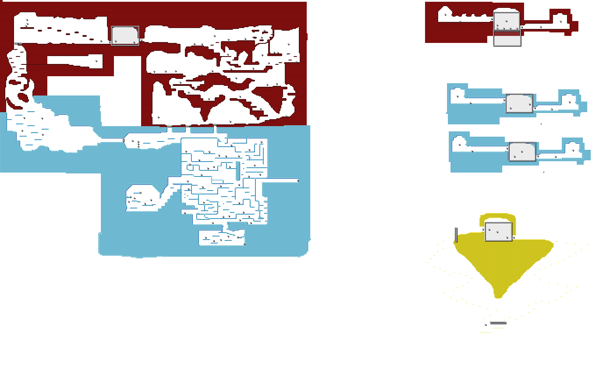

-------------------------------------------(Mapa principal)-------------------------------------------------------------(Sala bosses y zona final)--------

# **Mecánicas del juego**

## **Ciclo del juego**

El juego será lineal, de esta manera será más sencillo de equilibrar y
diseñar, es decir el orden de derrotar a los bosses ya no será tan libre
para el jugador, habrá un orden de derrota.

El ciclo de juego consiste en:

1.  Tutorial.

2.  Derrotar a los bosses para recuperar el poder (1-3).

3.  Volver al lugar inicial para abrir el camino hacia el cielo.

4.  El camino hacia el cielo, es un floor is lava.

5.  Derrotar al jefe final.

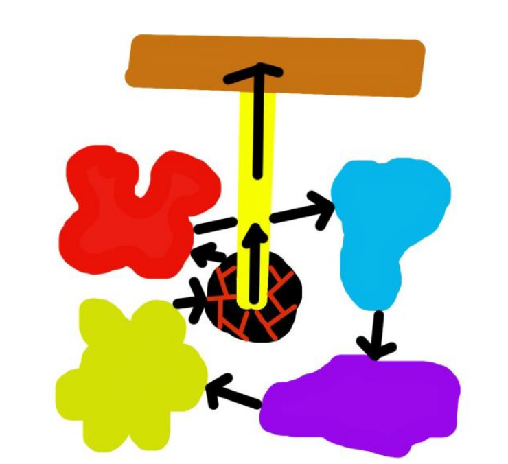
*(En la version final del juego solo se incluye dos zonas, morada y verde no incluido)*

Al principio el jugador aparecerá en el la zona inicial del mapa, lugar donde será el inicio y el fin del juego, ya que aquí es el lugar donde se
encuentra el camino que conecta el infierno.

Después de un pequeño tutorial que enseña al jugador como controlarse,
aparecerá un mini boss, que el jugador tendrá que derrotarlo, pero no se
preocupe, este no atacará al jugador.

Tras derrotarlo, empieza la aventura, el jugador tendrá que ir derrotando a los bosses del juego para recuperar el poder, los cuales le permite avanzar y descubrir nuevas zonas del mapa.

Cuando se recupera todo el poder, debe volver a la zona inicial y abrir
el camino hacia el cielo. Mientras subes, la lava del infierno te
perseguirá, tratando de impedir tus pasos.

En el final del camino, pensarás que este será el final del juego, pero
no, habrá un último jefe final.

## **Controles**

Los controles será solo con teclado.

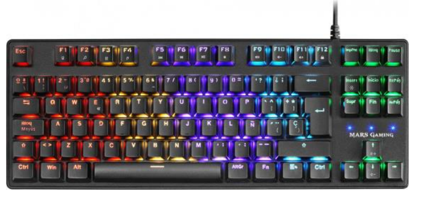

Los controles son muy parecidos a Hollow Knight, es decir no habrá ratón
para apuntar, es totalmente controlado con el teclado.

En juego:

-   A: mover hacia la izquierda

-   D: mover hacia la derecha.

-   Up-Arrow: ataque a melee hacia arriba

-   Down-Arrow: ataque a melee hacia abajo

-   Left-Arrow: ataque a melee / distancia hacia izquierda

-   RIght-Arrow: ataque a melee / distancia hacia derecha

-   Space / W: saltar

-   Q: cambiar orbe activo

-   E: interactuar

-   C: usar habilidad del orbe activo

-   ESC: menu de pausa

En menú:

-   Se controla con el ratón.

-   Esc: volver hacia atrás (el último menú que estabas, si estás ya en el menú principal no hace nada).

## **Objetivos del jugador**

El jugador debe de superar los puzzles y enemigos que se encuentran de
camino hacia los bosses. Al derrotarlo, el ángel recuperará parte de su
poder.

Cuando el jugador consigue recuperar todo el poder original del ángel,
podrá tener la oportunidad de ascender de nuevo hacia el cielo. Si,
oportunidad, de camino la lava del infierno te perseguirá y cuando
piensas que ya has llegado al cielo, por desgracia no lo es, aparecerá
un boss muy poderoso que te impedirá volver.

## **Sistemas**

### **Sistema movimiento**

**Desplazamiento lateral**: El jugador se encarga de mover al
protagonista. Se mueve corriendo a izquierda y a derecha a una velocidad
constante.

***Parámetros:***

-   Velocidad horizontal: Velocidad (u/s) a la que se mueve el personaje
 mientras está en el suelo o en el aire.

**Saltos**: El jugador podrá hacer uso de saltos para alcanzar
plataformas altas o esquivar ataques. El salto será un impulso fuerte
hacia arriba, se mantendrá brevemente en el aire antes de volver a caer
con aceleración, aunque al caer no podrá exceder una velocidad máxima de
caída. Se podrá saltar en una dirección y cambiarla en el aire a otra.

Para mejorar la jugabilidad y sensación del salto se implementarán las
siguientes técnicas. Por un lado, se utiliza el "Input buffering", que
permite al jugador presionar la tecla del salto en el aire un tiempo
antes para saltar nada más llegar al suelo. Por otro lado, también se
usa el "Coyote time", que permite al jugador saltar un tiempo después de
dejar de estar en contacto con una plataforma.

Si el jugador pulsa el boton de salto mientras ha dañado a un enemigo
atacando hacia abajo (con down-arrow), puede hacer un pogo Jump, que

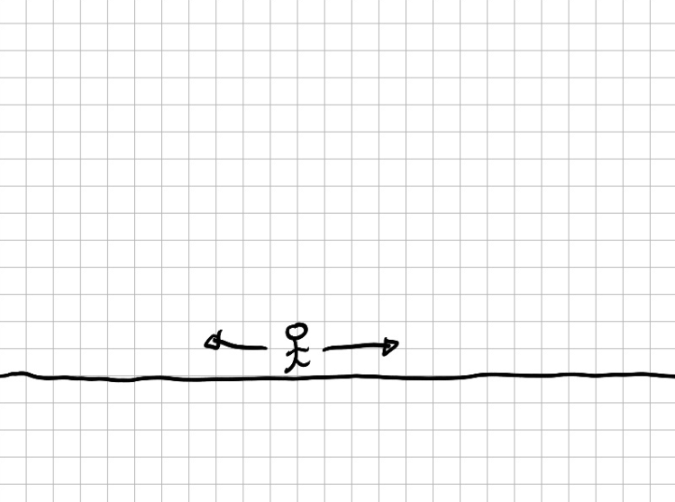

***Parámetros:***

-   Altura máxima de salto: Distancia (u) máxima que puede saltar el
     personaje hacia arriba.

-   Tiempo que tarda en llegar a la altura máxima: Segundos (s) que
     tarda el personaje en llegar al apex del salto tras saltar.

-   Gravedad: Aceleración (u/s\^2) que tiene el jugador en el aire.

-   Velocidad máxima de caída: Velocidad (u/s) máxima a la que puede
     caer el personaje.

-   Input buffer: Segundos (s) que se almacena la tecla de salto del
     jugador para hacer el salto más tarde.

-   Coyote time: Segundos (s) de gracia que se le da al jugador para
     saltar en el aire tras dejar de estar en una plataforma.

-   PogoJumpJudgeTime: Segundos (s) de margen de error que da al pogo
     Jump

-   PogoJumpSpeed: Velocidad (u/s) máxima del pogojump del personaje.

-   Tiempo del ápex (retención en el aire): Segundos (s) que el jugador
     se mantiene en la altura máxima del salto.

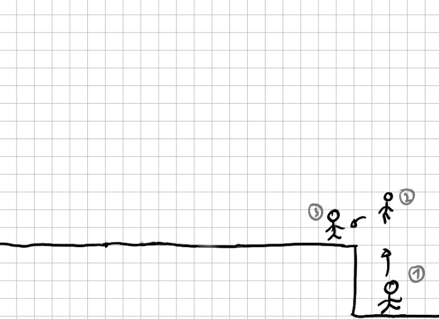

**Dash**: Permite al jugador trasladarse rápidamente horizontalmente en
la dirección en la que mire el personaje. Este se recargará con un
tiempo, impidiendo al jugador hacer más de un dash seguido. El tiempo de
recarga comenzará inmediatamente cuando comienza el dash. Mientras está
en uso se es inmune al daño de enemigos.

Esta técnica se puede combinar con la mecánica de salto, pudiendo
ejecutar un "Dash" en el aire tras realizar un salto o mientras se cae.
En cambio el dash no podrá ser interrumpido de ninguna forma.

***Parámetros:***

-   Distancia recorrida: Distancia que recorre el jugador al hacer un
    > dash.

-   Tiempo de duración: Tiempo en el que recorre la distancia.

-   Tiempo de recarga: Tiempo (s) que tarda el dash en recargarse.

### **Sistema de combate**

**Ataque básico**: El jugador dispone de un ataque básico de corta
distancia que se ejecuta en unas 4 dirección, 2 horizontales y 2
verticales, dependiendo de la tecla que pulse. Consiste en un ataque
rápido semicircular que no hace mucho daño a los enemigos. El ataque
básico se puede realizar en el aire, también hacía 4 direcciones,
exactamente igual que como cuando esta en el suelo, mientras ataca cae
según la gravedad como si no hubiese atacado. La velocidad del ataque
básico será rápida.

***Parámetros:***

-   Daño: Vida que quita a los enemigos que reciben los dos primeros
     ataques de la encadenación.

-   Tiempo de ataque: Tiempo (s) que tarda en realizarse el ataque
     básico.

-   Tiempo de gracia: Tiempo (s) que tiene el jugador para volver a
     atacar si quiere encadenar los ataques.

-   Radio de ataque: Distancia (u) del radio de la circunferencia que
     representa el impacto del arma.

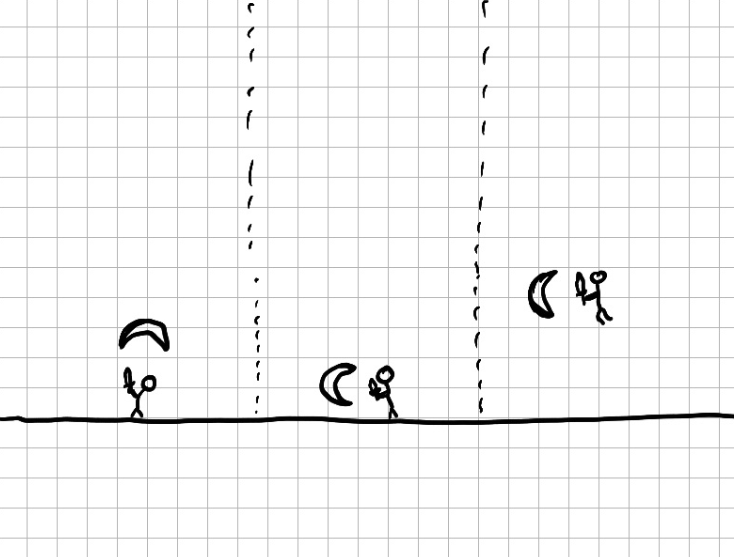

**Ataque a distancia (ataque con pluma)**: El jugador lanza un ataque a
distancia hacia la dirección horizontal que mira el jugador. solo se
puede lanzar hacia las dos direcciones horizontales. El ataque a
distancia se puede realizar en el aire, también hacía 2 direcciones
horizontales, exactamente igual que como cuando está en el suelo,
mientras ataca cae según la gravedad como si no hubiese atacado. La
velocidad del ataque básico será muy rápida. Este ataque se autodestruye
al superar una distancia o si se choca con un enemigo o plataforma.

***Parámetros:***

-   Daño: Vida que quita a los enemigos que reciben los dos primeros
     ataques de la encadenación.

-   Tiempo de ataque: Tiempo (s) que tarda en realizarse el ataque
     básico.

-   Tiempo de gracia: Tiempo que tiene el jugador para volver a usar un
     ataque a distancia.

-   Distancia de ataque: Distancia (u) que recorre el ataque lanzado
     hasta autodestruirse.

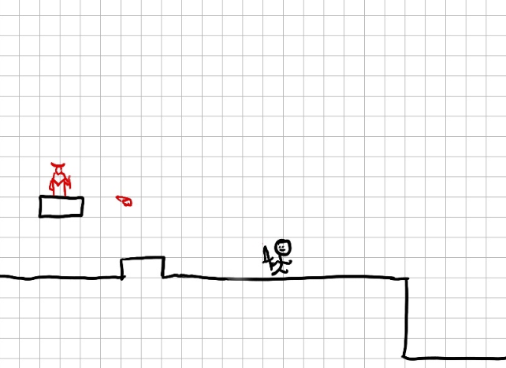

**Escudo de hielo:** El jugador consiste en un escudo de hielo que le
bloquea el siguiente ataque enemigo, ósea reduce el siguiente daño
recibido a 0, este escudo no se destruye con el tiempo, solo se destruye
si se recibe daño, y al destruirse se regenera en un cierto tiempo.

***Parámetros*** Tiempo de regeneración: Tiempo (s) que tarda en
reaparecer el escudo al ser destruido.

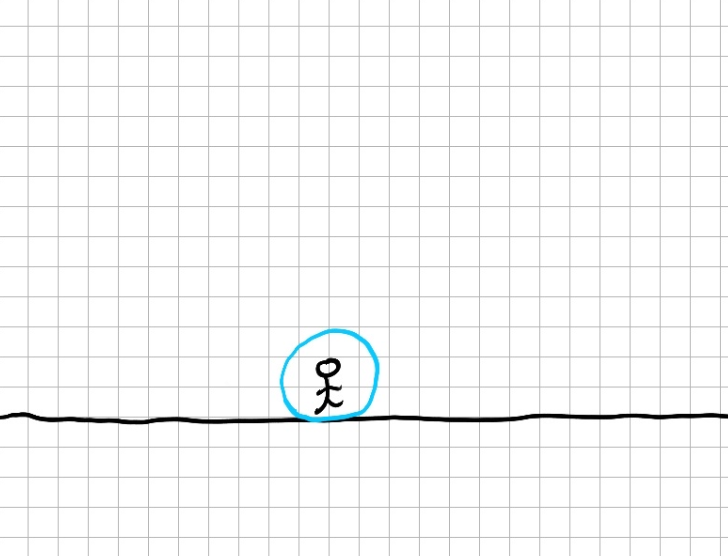

### **Sistema de habilidades**

**Conseguir habilidades:**

El jugador puede recoger orbes de habilidades al colisionar con él (es
un objeto recogible, detalle en [[sistema de
interactuar]{.underline}](#sistema-de-interactuar)) a su lista de orbes
recogidos, y como máximo puede equipar dos orbes y activar uno de ellos.

El jugador puede pulsar la tecla de cambiar orbe activo para cambiar de
orbe activado, donde pierde la habilidad del orbe anterior y consigue la
habilidad del nuevo orbe activado.

El jugador solo puede cambiar los orbes equipados cuando se encuentra en
un checkpoint.

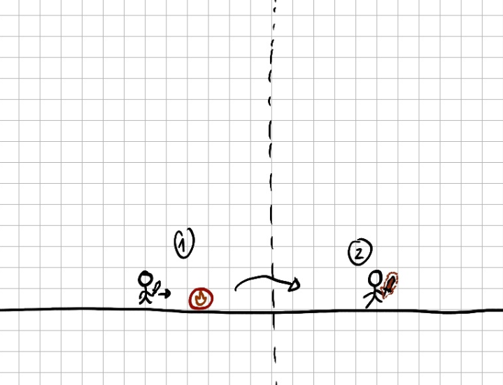

**Orbe de daño:** El jugador hará mas daño a los enemigos con sus
ataques básicos.

     Parámetros: Daño aumentado: Cantidad de daño que aumenta el ataque cuerpo a cuerpo del jugador.

**Orbe de escudo:** desbloquea el escudo de hielo (previamente
especificado en [[sistema de combate]](#sistema-de-combate))

**Orbe de ataque a distancia:** desbloquea el ataque a distancia del jugador
(previamente especificado en [[sistema de
combate]{.underline}](#sistema-de-combate))

**Orbe de dash:** el jugador desbloquea el dash (previamente
especificado en [[sistema de combate]](#sistema-de-combate))

**Orbe de velocidad movimiento:** aumenta la velocidad de movimiento del jugador

     Parámetros: Velocidad aumentado: Cantidad de velocidad que aumenta el jugador.

**Orbe de salto:** aumenta la altura de salto del jugador

     Parámetros: Altura aumentado: Cantidad de altura que aumenta el saltod de jugador.

**Orbe de rango de ataque:** aumenta rango de ataque melee del jugador

     Parámetro: Rango aumentado: Cantidad de rango que aumenta el
ataque básico del jugador.

**Orbe de robar vida:** cuando el jugador mata un enemigo, regenera vida

     Parámetros: Vida regenerada: cantidad de vida que recupera el jugador

### **Sistema de interactuar**

**Objetos recogibles:**

El jugador puede colisionar (tocarlo con su personaje) con el objeto
recogible para conseguir el efecto de ese objeto.

**Checkpoint:**

El jugador puede interactuar(dar a la tecla de interactuar) con el
checkpoint para activarlo y regenerar su vida hasta máximo. A la hora de morir (ver detalle en [[sistema de vida]](#sistema-de-vida)), reaparece en el último checkpoint que ha activado.

Si el jugador interactua con un checkpoint ya activado, puede abrir el panel de seleccion de orbes [[sistema de habilidades]](#sistema-de-habilidades).

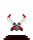
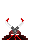

**Puerta con Botones**
El jugador puedo interactuar con botones que se activa al pulsar E, se cambia la textura y envía señal a su puertas correspondiente,
es usados especialmente en el puzzle de la TristezaBossDoor

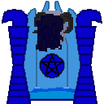

**Puerta sala boss**
Son puertas que lleva el juagdor a una sala boss o volver al mapa desde sala boss.
Se activan al interactuar y teletransportan al jugador.

**Puerta boss final**
Funciona como una puerta sala boss normal pero no se activa hasta que hayas matado a los 3 bosses.

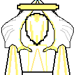

### **Sistema de vida**

El jugador cuenta con una cantidad de vida. Inicia la partida con la
vida máxima, y cada vez que el jugador reciba un ataque enemigo, éste
pierde vida según el daño del enemigo. Si el jugador se queda con 0 de
vida, pierde el progreso hasta el último checkpoint guardado. Al
reaparecer en el checkpoint.

***Parámetros:***

-   Vida máxima: Cantidad de vida inicial del jugador.

**Tiempo de gracia**: Tras recibir daño, el jugador tendrá un tiempo de
gracia durante el cual el jugador no podrá recibir más golpes.

***Parámetros:***

-   Tiempo: Tiempo(s) que dura el tiempo de gracia.

**Knockback**: Cuando el jugador recibe daño, dependiendo del ataque
puede recibir un knockback o no, que consiste en un retroceso que se
aplica al jugador empujando hacia la dirección contraria del ataque
donde no puede hacer ninguna acción mientras tanto.

***Parámetros:***

-   Distancia de knockback: Distancia en la que es empujado el jugador

-   Tiempo de knockback: Tiempo(s) donde el jugador no puede hacer ninguna accion.

-   dirección de knockback: Dirección que es empujado el jugador

**Regeneración de vida**

El jugador puede regenerar vida hasta su vida máxima al activar un
checkpoint.

# **Contenido**

## **Niveles**

-   Zona central: es el lugar de inicio y fin del juego, aquí aparecerá
     un mini boss como tutorial que enseña al jugador a cómo
     controlarse, pero al perder los poderes el ángel no tendrá manera
     de atacar. Entonces, después de superar el tutorial este mini boss
     dropeará una espada.

-   Zona Bosses: ira, tristeza, miedo, final...

Ejemplo de bocetos de la zona de miedo (una zona, para mostrar el diseño
del mapa):

-   Camino hacia el cielo.

-   Zona Boss Final.

-   Caminos que conectan con las zonas de los bosses.

Ejemplo de bocetos de la zona de miedo (una zona, para mostrar el diseño
del mapa):

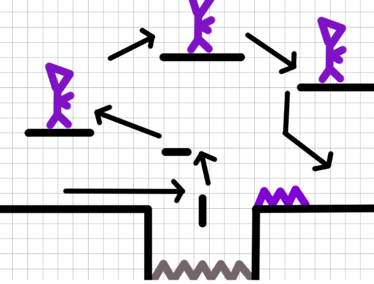 
##  

## **Enemigos principales**

Todos los enemigos tienen dos formas: ira y tristeza, que solo se cambian en la textura y animacion, la logica es igual.

**Enemigo melé:** Se mueven en línea recta sobre las plataformas. Son
fáciles de matar y solo tienen un tipo de ataque. Cuando detectan al
jugador en un rango, lo persiguen. Atacan causando daño cuando el
jugador entra en su rango de ataque. Este sería un semicírculo en la
dirección que miran. No detectan a los jugadores que no están en su eje
Y,

***Parámetros:***

-   Daño: Vida que quita al jugador al asestar un golpe.

-   Rango de ataque: Longitud (u) del radio de la semicircunferencia del efecto del ataque.

-   Rango de detección: Longitud (u) del radio circular de la zona de detección.

-   Velocidad de ataque: Tiempo (s) que tarda en poder volver a realizar el ataque.

-   Vida: Vida máxima del enemigo.

-   Velocidad de movimiento: Velocidad (u/s) a la que se desplaza el enemigo en horizontal.

-   Distancia de detección del jugador: Radio (u) de la circunferencia que representa el área de detección del jugador.

**Enemigo a distancia:** Enemigo que pueden atacar disparando
proyectiles.

Sus proyectiles se disparan en línea recta en la dirección del jugador y
tienen un alcance máximo. El proyectil atraviesa paredes y al resto de
enemigos sin causarles daño ni destruirse.

***Parámetros:***

-   Daño: Vida que quita al jugador al asestar un golpe.

-   Alcance de proyectiles: Distancia (u) máxima que alcanzan los
     proyectiles del enemigo.

-   Velocidad de ataque: Tiempo (s) que tarda en poder volver a lanzar
     un proyectil.

-   Vida: Vida máxima del enemigo.

-   Velocidad de movimiento: Velocidad (u/s) a la que se desplaza el
     enemigo en horizontal.

-   Distancia de detección del jugador: Radio (u) de la circunferencia
     que representa el área de detección del jugador.

-   Velocidad de proyectil: la velocidad en la que avanza su ataque
     lanzado.

**Enemigo a distancia voladores:** Enemigos a distancia que vuelan, 

***Parámetros:***

-  Todos los de enemigo a distancia normal

-  Velocidad de movimiento vertical: Velocidad (u/s) a la que se desplaza el
     enemigo en vertical.

## **Bosses** 

**Boss 0: boss inicial/tutorial**: es un mini boss que enseña al player como esquivar y hacer ataques. Tiene dos fases.

Fase 1: solo hace un ataque en esta fase, el boss se mueve de lado a lado, y si choca al player le hace daño. Si de camino no ha dañado al player, entonces se hace daño a si mismo, como si hubiera chocado a la pared.

Cuando se queda sin vida, pasa a la fase 2.

Fase 2: se le añade un nuevo ataques más, el boss salta al aire y se lanza hacia el player, para hacerle daño.

Antes de empezar el ataque, se avisa al jugador de este ataque enseñando
su rango con cierto tiempo de antelación para que le de tiempo al
jugador a reaccionar. 

***Parámetros:***

-   Daño: Vida que quita al jugador al asestar un golpe.

-   Tiempo de inmovilización: Tiempo que se queda inmovilizado al
     colisionar.

-   Vida: Vida máxima del enemigo.

-   Velocidad de movimiento: Velocidad (u/s) a la que se desplaza el
     enemigo en horizontal.

-   Distancia de detección del jugador: Radio (u) de la circunferencia
     que representa el área de detección del jugador.

-   Daño recibido: vida que se baja al colisionar con un obstáculo que
     no sea el jugador.

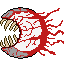

**Boss 1: Ira:** es un enemigo inmóvil que flota en el aire, tiene dos
fases.

Fase 1: tiene dos tipos de ataque. Primero desde los laterales salen puños del boss que intentan hacerte daño, puede venir de la derecha o izquierda.
Segundo, desde el techo caen varios bolas de fuego, su rango es aleatorio por todo el eje horizontal de la sala boss.

Cuando se queda sin vida, pasa a la fase 2.

***Parámetros:***

-   Daño: Vida que quita al jugador al asestar un golpe.

-   Tiempo de espera entre ataques: Tiempo que no hace nada entre
     ataques.

-   Vida: Vida máxima del enemigo.

-   Tiempo de señal de ataque: Tiempo de antelación que indica al
     jugador el rango de su siguiente ataque

-   Rango de ataque: diagonal(u) del rectángulo que representa el rango
     de su ataque.

-   Tiempo de regeneración de plataformas: tiempo que tarda la
     plataforma destruida por su ataque en reaparecer.

Fase 2: se le añade un nuevo tipo de ataque, en esta fase, el boss tiene tres tipos de ataque. Los dos de la fase 1, más otro ataque, que es igual que las bolas de
fuego, caen desde el techo el puño del boss, este puede hacer daño al player, y también puede hacer desaparecer la plataforma que colisiona, haciendo que tenga menos espacio para el player para moverse. Si el player cae de la plataforma, muere de inmediato.

Antes de empezar el ataque, se avisa al jugador de este ataque enseñando
su rango con cierto tiempo de antelación para que le de tiempo al
jugador a reaccionar. 

***Parámetros:***

-   Daño: Vida que quita al jugador al asestar el proyectil.

-   Tiempo de espera entre ataques: Tiempo que se espera entre ataques.

-   Vida: Vida máxima del enemigo.

-   Tiempo de señal de ataque: Tiempo de antelación que indica al
     jugador el rango de su siguiente ataque

-   Cantidad de proyectiles: unidad de proyectiles que se lanza al mismo
     tiempo.

-   Velocidad de proyectil: velocidad a la que caen los proyectiles
     hacia el suelo.

-   Alcance de proyectiles: Distancia (u) máxima que alcanzan los
     proyectiles del enemigo.

-   Radio de proyectil: unidad que mide el radio del proyectil que lanza
     hacia el suelo.

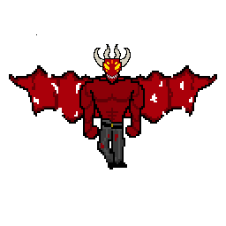

**Boss 2: Tristeza:** es un enemigo inmóvil que se sitúa a la derecha, tiene dos fases.

Fase 1: tiene dos tipos de ataque. Primero el boss lanza una bola de agua, que persigue al player durante unos segundos, si durante esos segundos no daña al player, crea un área de explosión como otra manera de dañar al player. También a esta bola de agua, el player puede hacer un ataque para destruirlo y no hacer daño. Segundo, lanza un ataque círcular, que son carámbanos en forma círculo.

Cuando se queda sin vida, pasa a la fase 2.

***Parámetros:***

-   Daño: Vida que quita al jugador al asestar un golpe.

-   Tiempo de espera entre ataques: Tiempo que no hace nada entre
     ataques.

-   Vida: Vida máxima del enemigo.

-   Tiempo de señal de ataque: Tiempo de antelación que indica al
     jugador el rango de su siguiente ataque

-   Rango de ataque: Área de la explosión que crea la bola de agua.

-   Tiempo de seguimiento: Tiempo de la bola de agua que persigue la player.

-   Cantidad de carámbanos: Números de carámbanos que lanza.

-   Vida de bola de agua: Cuántos ataques puede aguantar la bola de agua del ataque player.

Fase 2: se le añade un nuevo tipo de ataque, en esta fase, el boss tiene tres tipos de ataque. Los dos de la fase 1, más otro ataque, que desde el techo cae un carámbano que intenta dañar al player

Antes de empezar el ataque, se avisa al jugador de este ataque enseñando
su rango con cierto tiempo de antelación para que le de tiempo al
jugador a reaccionar. 

***Parámetros:***

-   Daño: Vida que quita al jugador al asestar el proyectil.

-   Tiempo de espera entre ataques: Tiempo que se espera entre ataques.

-   Vida: Vida máxima del enemigo.

-   Tiempo de señal de ataque: Tiempo de antelación que indica al
     jugador el rango de su siguiente ataque

-   Velocidad de proyectil: velocidad a la que caen los proyectiles
     hacia el suelo.

-   Radio de proyectil: unidad que mide el radio del proyectil que lanza
     hacia el suelo.

**Boss 3 (oculto): Miedo:** es un enemigo oculto que flota en el aire, no tiene cuerpo, su cuerpo puede ser cualquier cosa, según nosotros en este mundo vemos un corazón. Tiene dos fases.

Fase 1: tiene dos tipos de ataque. Primero el boss saca sus garras y hace un ataque en forma de X.

Cuando se queda sin vida, pasa a la fase 2.

***Parámetros:***

-   Daño: Vida que quita al jugador al asestar un golpe.

-   Tiempo de espera entre ataques: Tiempo que no hace nada entre
     ataques.

-   Vida: Vida máxima del enemigo.

-   Tiempo de señal de ataque: Tiempo de antelación que indica al
     jugador el rango de su siguiente ataque

-   Eje X/Y inicial y final: Representan la posición incial y final de las garras para hacer el recorrido en X.

Fase 2: se le añade un nuevo tipo de ataque, en esta fase, el boss tiene dos ataques. El nuevo ataque hace caer desde el techo, varios vasos que intentan hacer daño al player.

Antes de empezar el ataque, se avisa al jugador de este ataque enseñando
su rango con cierto tiempo de antelación para que le de tiempo al
jugador a reaccionar. 

***Parámetros:***

-   Daño: Vida que quita al jugador al asestar el proyectil.

-   Tiempo de espera entre ataques: Tiempo que se espera entre ataques.

-   Vida: Vida máxima del enemigo.

-   Tiempo de señal de ataque: Tiempo de antelación que indica al
     jugador el rango de su siguiente ataque

-   Velocidad de proyectil: velocidad a la que caen los proyectiles
     hacia el suelo.

-   Radio de proyectil: unidad que mide el radio del proyectil que lanza
     hacia el suelo.

  

**Boss final:** es un boss final que sabe todos los tipos de ataque de los otros bosses. Tiene dos fases.

Fase 1: hace un random de todos los ataque de otros bosses, y elige tres de ellos, eso quiere decir en cada partida el boss final en la primera fase, tiene ataques diferentes.

Cuando se queda sin vida, pasa a la fase 2.

Fase 2: en esta fase, el boss final coge todos los ataques que existe de otros bosses.

Antes de empezar el ataque, se avisa al jugador de este ataque enseñando
su rango con cierto tiempo de antelación para que le de tiempo al
jugador a reaccionar. 

##  

## **Música y sonido**

Estilo musica rock, con sfx estilo 8 bits

# **UI**

## **Menús**

-  Menu principal
     Donde se situa el boton de jugagar para entrar al juego 

-  Menú Pausa
     El jugador puedo volver al menu principal o continuar el juego

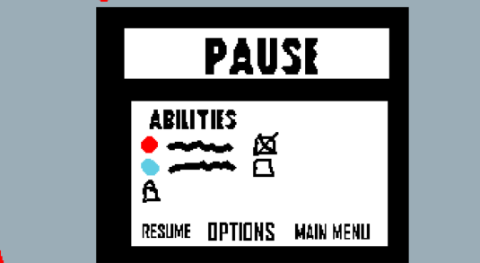

-   En juego 
     Donde el jugador controla al personaje y disfruta del juego 
     (Se ha cambiado que el ui de orbes actuales se encuentra ahora debajo de la barra de vida)
     CD representa la UI con los bosses matados actualmente, cuando se complete, el jugador podra acceder a la sala boss final

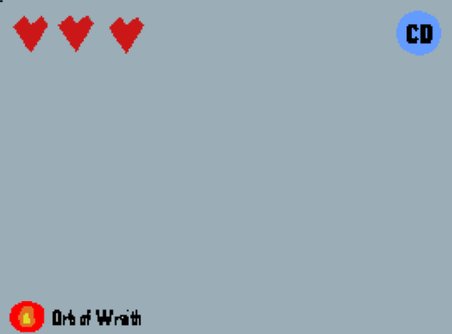

## **HUD**
Algunos ejemplos de arte UI

-   Algunos orbe de emociones: ira, tristeza

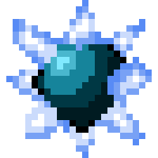 

-   Corazones de vida: marca la vida total y vida restante del personaje.

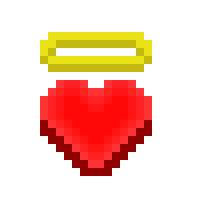

##  

## **Cámara**

La cámara será rectangular que siempre sigue al jugador. Sin embargo
cuando el jugador llega a los límites del mapa, este se detendrá para no
ver el vacío del exterior del mapa, misma idea que Hollow Knight.

La cámara hace un shake al hacer un ataque o al usar el dash.

La cámara hace un shade in y shade off al entrar y salir de un nivel del
mapa.

***Parámetros:***

-   Velocidad de cámara: la velocidad a la que sigue al jugador.

-   Intensidad de cámara shake: la intensidad en la que se mueve la
     cámara.

-   Tiempo de shade in: tiempo que tarda la transición de cámara en
     mostrar color.

-   Tiempo de shade off: tiempo que tarda la transición de cámara en
     oscurecerse.

#  

# **Referencias**

-   El ambiente está inspirado en Hades, temática inframundo.

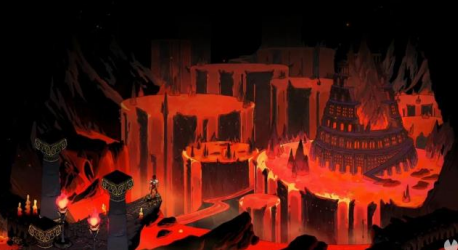

-   Los movimientos del personaje como la cámara, está inspirado en
     Hollow Knight.

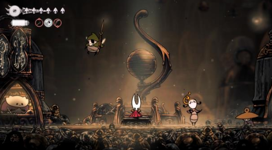

-   La mecánica en general está inspirada en Cup Head.

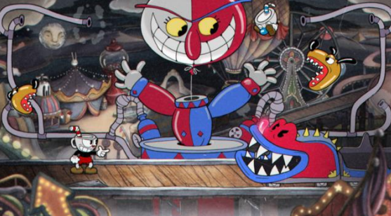

-   El diseño de las plataformas está inspirado sobre todo en Mario.

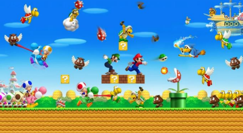
