# ASSETS — Highway to Heaven  
**Hecho por “Rocky Games”: Zhuokai Zhu, Chenlinjia Yi, Javier Cáceres Polo y Antonio Bucero Coronel**

-----------------------------------------------------------------------

## Gestión de Assets

Este directorio contiene los recursos gráficos, de audio, y de diseño utilizados en el proyecto.

### **Licencia de los Assets**

*Assets de Creación Propia*

Todos los Assets desarrollados específicamente para este proyecto son de creación propia y su licencia es exclusiva de este proyecto.

## Mapa

El juego consta de cuatro zonas distintas y una zona final.

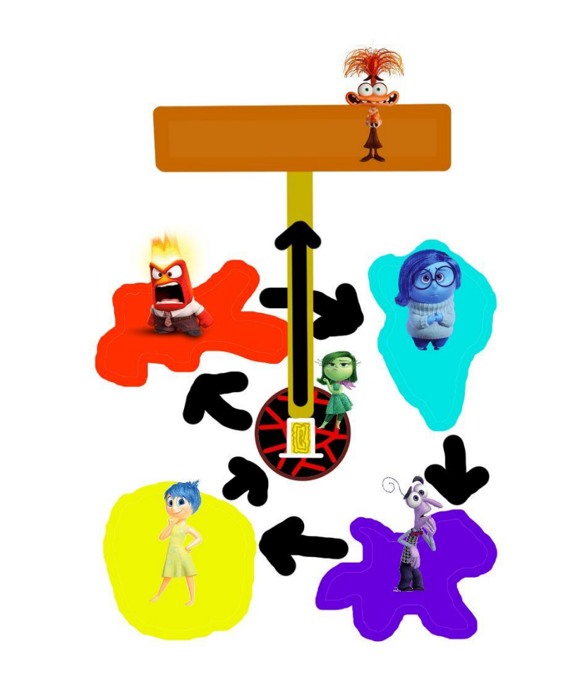

## Arte player

Nuestro protagonista es un ángel que vivía en el cielo, pero por un accidente cayó al infierno.
Para su sprite hemos decidido hacer un ángel, blanco y puro, pero con características demoníacas.

 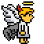 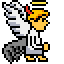 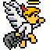

## Arte enemigos básicos y bosses

Como podemos ver en el mapa, en el juego existe cuatro zonas distintas, cada zona, hay un boss.
Estos bosses vienen del poder de las emociones del ángel. Por lo que cada zona define una emoción.
Los enemigos básicos son creados por los bosses, por lo que son pequeños, como si fuera espiíritus elementales.

### **Zona de ira**

Principalmente se usa la paleta de color rojo, como el fuego, magma, lava, calor, etc.

 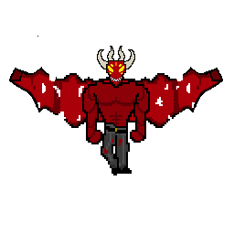 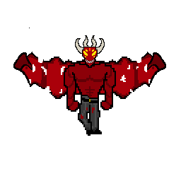 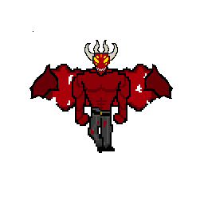 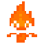

### **Zona de tristeza**

Principalmente se usa la paleta de color azul, como el agua, frío, hielo, etc.

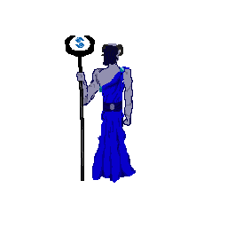 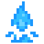

### **Zona de alegría**

Principalmente se usa la paleta de color amarillo, naranja, como el sol, cálido, luz, etc.
El sprite de boss está en proceso de creación, quisiéramos centrarnos en las dos primeras zonas.

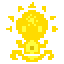

### **Zona de miedo**

Principalmente se usa la paleta de color negro, morado, como la oscuridad, siniestro, escalofriante, etc.
El sprite de boss está en proceso de creación, quisiéramos centrarnos en las dos primeras zonas.

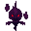

## UI

Para los ui del juego, también hemos optado por tener características del propio personaje principal y de los bosses.

### **Corazones de vida**

Son típicos corazones de pixelart, pero metiendo el aro del ángel y animación del corazón partido al perder vida.

### **Orbes**

Son powerups que conseguimos tras derrotar a los bosses, o encontrarlos por el mapa.
Por lo que sus sprites, tienen características de los bosses, o dependiendo del powerup que da.

 
