# ASSETS — *Highway to Heaven*  
**Hecho por “Rocky Games”:** Zhuokai Zhu, Chenlinjia Yi, Javier Cáceres Polo y Antonio Bucero Coronel  

---

## Gestión de Assets  
Este directorio contiene los recursos gráficos, de audio y de diseño utilizados en el proyecto.

---

## Licencia de los Assets

### Assets de Creación Propia  
Todos los assets desarrollados específicamente para este proyecto son de creación propia y su licencia es exclusiva de este proyecto.

---

## Arte  
Muchos de los artes han sido mejorados durante el Hito 3.

---

### Player  
Nuestro protagonista es un ángel que vivía en el cielo, pero debido a un accidente cayó al infierno.  
Para su sprite hemos decidido representarlo como un ángel blanco y puro, pero con características demoníacas, como cuernos y una de sus alas oscurecida.  
También tiene elementos extras obtenidos por los orbes, como el escudo y ataque a rango de pluma. Tambien al final los sprites del player sin espada ya no se usa.

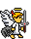
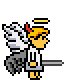
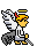
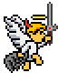
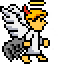

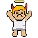
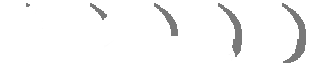

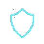
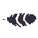

---

### Enemigos Básicos  
El juego consta de dos bosses principales, por lo que existen dos tipos de enemigos básicos: uno del bando de *Ira* y otro del bando *Tristeza*. Por esta razón el sprite de enemigo básico de miedo y alegría ya no se usan.

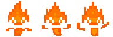
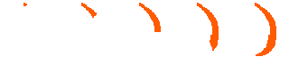

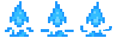
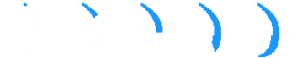

---

### Enemigos de Rango  
El arte proviene de Itch.io. Existen dos tipos de sprites, uno para *Ira* y otro para *Tristeza*.  

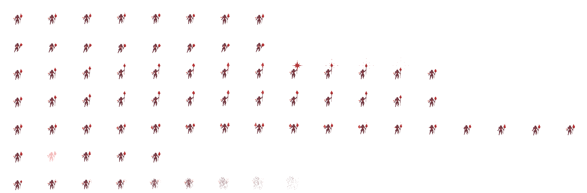
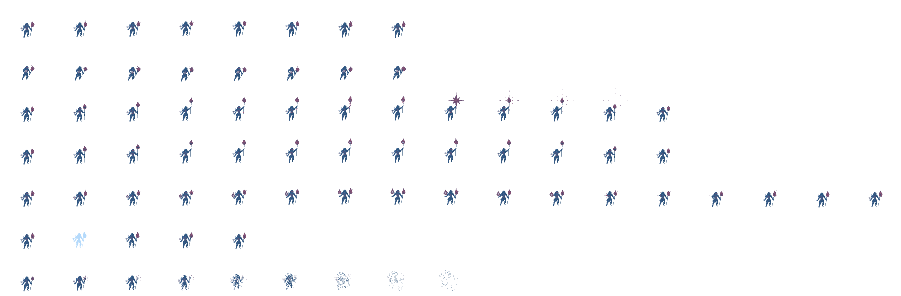

---

### Enemigo Mina  
Arte extraído de Itch.io. Se trata de un pequeño enemigo que se acerca rápidamente al jugador y explota. Existen dos sprites: uno del bando *Ira* y otro del bando *Tristeza*.  

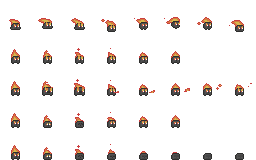
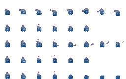

---

### Enemigos Voladores  
Arte extraído de Itch.io. Existen dos sprites: uno del bando *Ira* y otro del bando *Tristeza*.  

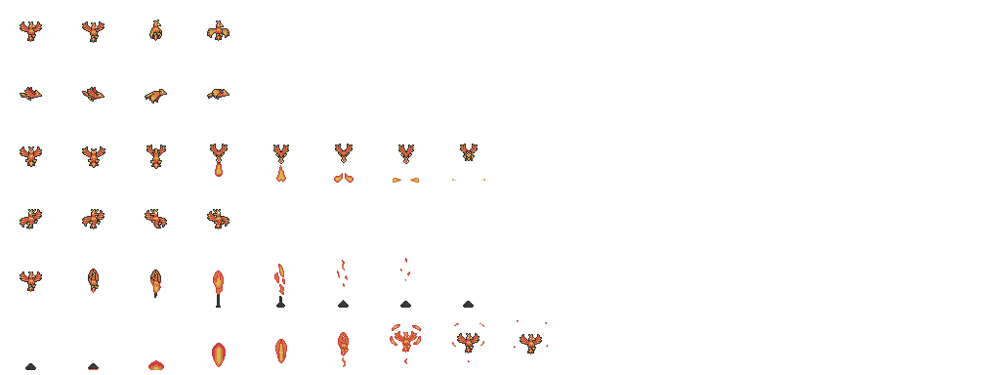
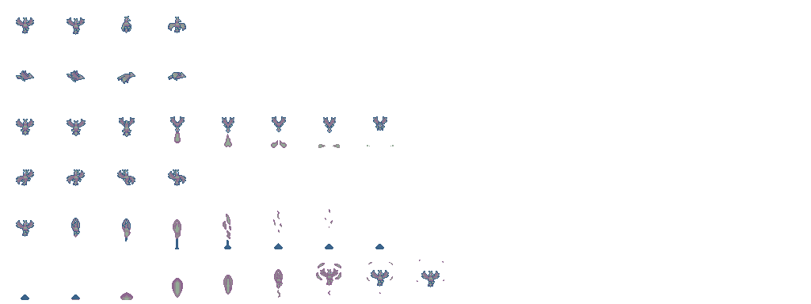

---

### Boss Tutorial  
Consiste en un ojo demoníaco con boca. No tiene animación.  

---

### Boss Ira  
Un demonio infernal tradicional. Tiene animación y ha recibido mejoras de sprite durante el Hito 3.  
Ataca lanzando bolas de fuego y sus propios puños.  

Antiguo

Mejorado
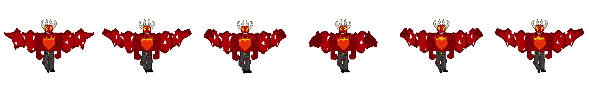

Ataques

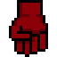
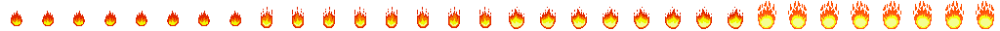

---

### Boss Tristeza  
Un demonio cabra con animación, también mejorado en el Hito 3.  
Su forma de atacar consiste en lanzar hechizos.  

Antiguo

Mejorado
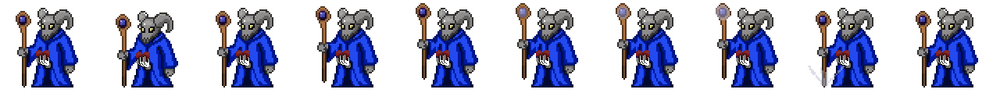

Ataques

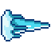
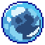

---

### Boss Miedo  
Inspirado en un payaso de película. No tiene cuerpo visible, por lo que se imagina como un corazón suspendido en el vacío.  
Ataca lanzando vasos y usando garras ocultas.  

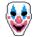
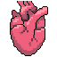

Ataques

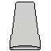
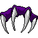

---

### Boss Final  
Como es el último boss antes de volver al cielo, incorpora elementos angelicales.  
Tiene animación y ataca utilizando las mecánicas de otros bosses, cambiando su sprite.  

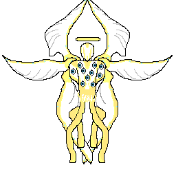
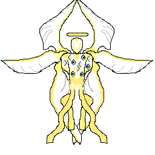

Ataques

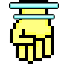
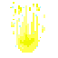
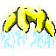
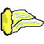
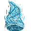
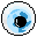

---

## Puertas de Boss  
Cada boss tiene su propio estilo de puerta.  

- **Ira:** mejorada durante el Hito 3.  

Antiguo

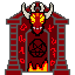

Mejorado
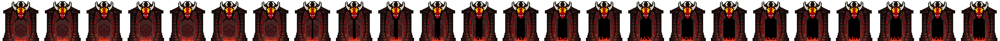

- **Tristeza:** mejorada durante el Hito 3.

Antiguo

Mejorado

- **Miedo**

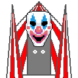
 
- **Final**  

## Puertas de la sala Boss
Una puerta para todas las salas de boss.

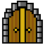

---

## UI

### Corazones del Player  
Corazones con temática angelical. Incluyen animación de rotura cuando el jugador pierde vida.  

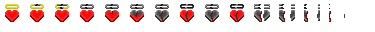

### Rastreador de Bosses  
Indica qué bosses han sido derrotados. Consiste en una piedra con forma de corazón en la que se colocan las piezas obtenidas al vencer a los bosses *Ira* y *Tristeza*.  
Al derrotarlos, se muestra un sprite encima de ambos. 

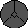

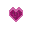

### Orbes  
Existe un sprite base de una piedra donde se colocan los orbes, acompañado de sprites adicionales para cada efecto distinto.  

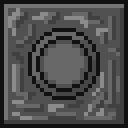
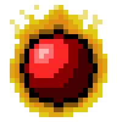

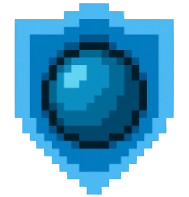
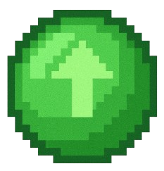
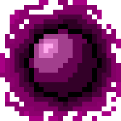
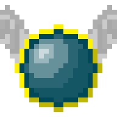

---

## Menús  
Para cada menú se ha generado una imagen y un texto mediante IA.  

---

## Elementos de la Escena

### Botones de la Puerta de Tristeza  
Tres colores diferentes de botones y tres colores de luces para indicar qué botón ha sido pulsado.  
Existe también un sprite para el botón presionado con la luz apagada.  

### Plataformas  
Dos tipos de plataformas: una para la zona de *Ira* y otra para la zona de *Tristeza*.  

### Lava  
Sprite mortal para el jugador al instante. Ha sido mejorado durante el Hito 3.  

Antiguo

Mejorado

### Bloque  
Sprite tipo puerta que bloquea la frontera entre las zonas de *Ira* y *Tristeza*.  

### Checkpoint  
Sprite de un cuerno con animación:  
- Desactivado: flota en el aire.  
- Activado: golpea el suelo.  

---

## Tiles  
Existen tres tipos de tiles:  
- Tile de *Ira*  
- Tile de *Tristeza*  
- Tile de *Boss Final*  

El boss *Miedo* es oculto y no posee tile propio para mantenerse oculto en el mapa.  

---

## Audio  
Los audios han sido extraídos de *Pixabay* y *FreeSound*.

### BGM  

[🔊 BGM](../assets/Sounds/Music/MainMusic.wav)

### Player  
**(Audio de player)**

### Bosses  
**(Audio de bosses)**

### Escena  
**(Audio de escena)**
